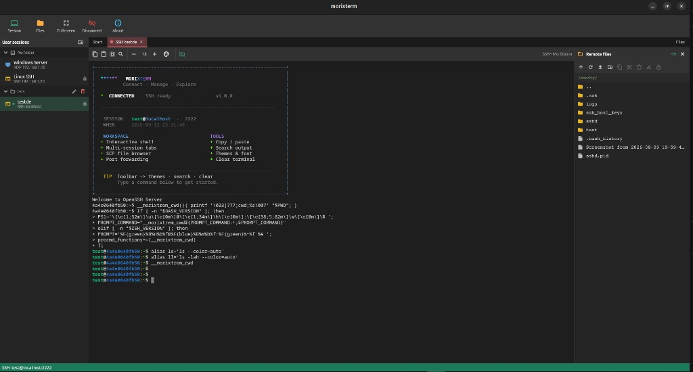

# morixterm

اپلیکیشن دسکتاپی مبتنی بر Flutter/Dart برای مدیریت اتصال‌های SSH/RDP، ترمینال تعاملی و مرور فایل‌های ریموت.



## وضعیت فعلی

نسخه‌ی `0.1.0` شامل پوسته‌ی دسکتاپ، فهرست جلسه‌ها، ساخت و حذف جلسه‌ی ذخیره‌شده، وضعیت اتصال و صفحه‌ی انتقال فایل است. اطلاعات جلسه با `SharedPreferences` به‌صورت محلی ذخیره می‌شود؛ رمز عبور عمداً ذخیره نمی‌شود. رابط‌ها برای اتصال backend آماده شده‌اند، اما اتصال واقعی RDP و کانال انتقال فایل هنوز به native Windows backend نیاز دارد.

## اجرا

روی سیستمی که Flutter Desktop نصب و فعال است:

```bash
flutter config --enable-windows-desktop
flutter pub get
flutter run -d windows
```

## معماری پیشنهادی backend

- لایه‌ی Flutter مسئول UI، مدیریت جلسه‌ها و صف انتقال فایل است.
- یک plugin ویندوزی با `MethodChannel`، session واقعی RDP را ایجاد می‌کند.
- برای RDP می‌توان از FreeRDP یا کتابخانه‌ی native مناسب ویندوز استفاده کرد.
- انتقال فایل باید از کانال virtual channel امن RDP یا SFTP/SMB مجاز استفاده کند و رمز عبور را در Credential Manager ویندوز نگه دارد.

تا زمانی که backend نصب نشده، دکمه‌های UI پیام راهنما نشان می‌دهند و هیچ فایلی به شبکه ارسال نمی‌شود.
